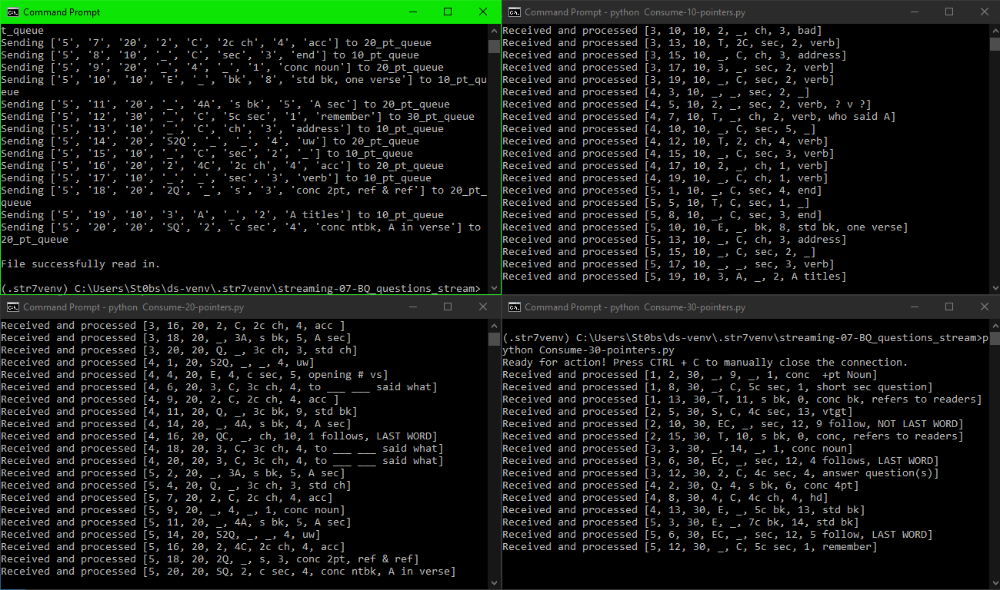

# Bible Quiz Question Analyzer
> Use RabbitMQ (data streaming platform) to send information regarding Bible Quiz questions to multiple queues.  Queues will calculate average hit points of given questions.

### Author: Solomon Stevens
### Date: June 13, 2024

## Prerequisites:
1. Have RabbitMQ installed and running on your local machine
2. Have Pika installed
TODO: Include links

## What is Bible Quiz:
Bible Quiz is a ministry based out of the Assembly of God denomination.  It encourages students ranging from 1st - 12th grade to engage in God's word through memorization.  For the older levels of quizzing (6th-12th grade), portions of the Bible are selected each year, and questions are written based on the chosen portion.
Throughout the schoolyear, teams from all over the country gather to compete in various levels of competition.  Each round pits two teams against each other.  There are twenty questions in each round, some 10 points, some 20 points, and some 30 points.  Whichever team has more points at the end of the twenty questions is declared the winner of the round.
There are a wide variety of introductory remarks designed to clue quizzers in as to what the question may be.  To keep a competitive edge, teams may try to analyze past questions and look for patterns to help their quizzers even more.

## Data sources:
> See `SourceFiles` for a list of given files
Each CSV file contains shorthand versions of the introductory remarks for each question as well as some notes about the question.

## How it works:
1. `Read-and-Produce-data.py` extracts question-introduction data from an appropriate CSV file
2. The same file will send the data to one of three queues based on the question's point value:
    1. `Consume-10-pointers.py`
    2. `Consume-20-pointers.py`
    3. `Consume-30-pointers.py`
3. Each consumer will calculate the average hit point of all questions with a specific introduction
    * NOTE: If there are multiple introductions, the consumer takes into account the combination of them
    * "Give a Complete Answer" is different from "Scripture-Text Question. Give a Complete Answer"
4. Once all the necessary averages are calculated, each consumer will write their results to a common output file.
    * NOTE: The information is written to the output file once the program is manually shut down
    * Close the queues in ascending order (10, 20, 30 point questions) for best results.

## Screenshots:
